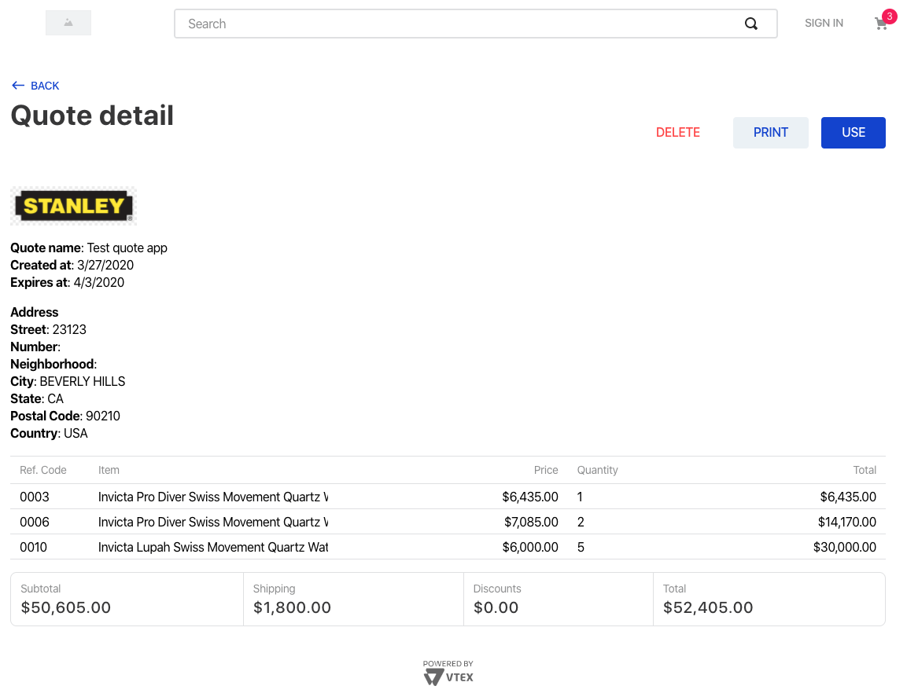

`📢 Use this project, [contribute](https://github.com/vtex-apps/orderquote) to it or open issues to help evolve it using [Store Discussion](https://github.com/vtex-apps/store-discussion).`

# Order Quote

<!-- ALL-CONTRIBUTORS-BADGE:START - Do not remove or modify this section -->
[](#contributors-)
<!-- ALL-CONTRIBUTORS-BADGE:END -->

This app provides **B2B** capabilities to save and print a user's minicart data (such as product items, total quantity and price) for further use. 



## Configuration

1. [Install](https://vtex.io/docs/recipes/development/installing-an-app/) the Order Quote app by running `vtex install vtex.orderquote@1.x`.
2. Open your store's Store Theme app directory in your code editor.
3. Add the Order Quote app as a `peerDependency` in the `manifest.json` file:

```diff
 "peerDependencies": {
+  "vtex.orderquote": "1.x"
 }
```

4. Access your VTEX account's admin and click on the Apps section. 
5. Access My apps.
6. Look for the Order Quote app. 
7. Once the app box shows up, click on Settings.
8. In the Settings section, fill in the `Lifespan` and `Store Logo URL` fields according to your store's needs. Their values define the data expiration date and the Logo displayed in the Order Quote page, respectively. 
9. Save your changes.

:information_source: *Once installed, the app will generate new routes for your store, as stated in the table below. Present those routes to your store users in order to make available the Order Quote functionalities. The new pages already contains a default template with all mandatory blocks, meaning that the Order Quote page is ready to be rendered and no further actions are required.*

| Gerenated route        | Description                                                                            |
| ---------------------- | -------------------------------------------------------------------------------------- |
| `/orderquote`          | Lists all saved minicart data.                                                           |
| `/orderquote/create`   | Retrieve the user's current minicart data.                    |
| `/orderquote/view/:ID` | Product details page to where users are redirected when they click on a specific listed minicart information.  |

## Customization

In order to apply CSS customizations in this and other blocks, follow the instructions given in the recipe on [Using CSS Handles for store customization](https://vtex.io/docs/recipes/style/using-css-handles-for-store-customization).

| CSS Handles               |
| ------------------------- |
| `buttonDelete`            |
| `buttonPrint`             |
| `buttonSave`              |
| `buttonsContainer`        |
| `buttonUse`               |
| `checkboxClear`           |
| `containerCreate`         |
| `containerFields`         |
| `containerList`           |
| `containerView`           |
| `createButton`            |
| `field`                   |
| `inputCreate`             |
| `inputCreate`             |
| `listContainer`           |
| `logo`                    |
| `notAuthenticatedMessage` |
| `printingArea`            |
| `totalizerContainer`      |

<!-- DOCS-IGNORE:start -->

## Contributors ✨

Thanks goes to these wonderful people:

<!-- ALL-CONTRIBUTORS-LIST:START - Do not remove or modify this section -->
<!-- prettier-ignore-start -->
<!-- markdownlint-disable -->
<!-- markdownlint-enable -->
<!-- prettier-ignore-end -->

<!-- ALL-CONTRIBUTORS-LIST:END -->

This project follows the [all-contributors](https://github.com/all-contributors/all-contributors) specification. Contributions of any kind are welcome!

<!-- DOCS-IGNORE:end -->
